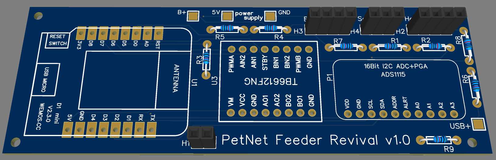
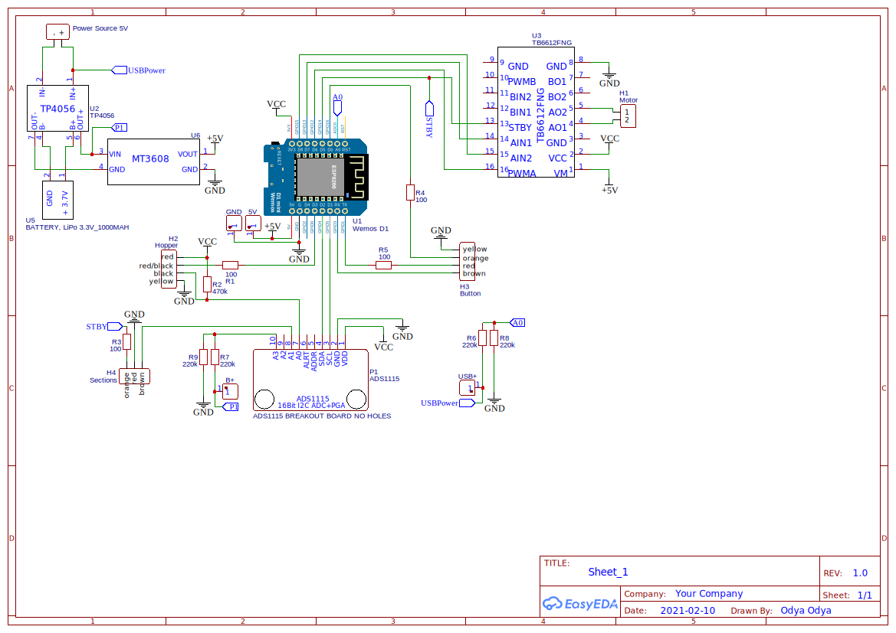

# esphome-petnet-feeder
Petnet SmartFeeder 1st Gen Revival Project: Bring your feeder back to life with the ESP8266 controller and native Petnet hardware!



> [!IMPORTANT]
> This project requires basic soldering skills and tools!

## How to build
### Hardware
1) Create PCB from [Gerber file](docs/Gerber_PCB_PetNet%20Feeder.zip) or order it on JLCPCB via [EasyEDA Project](https://oshwlab.com/ganzevich/petnet-feeder)
2) Solder all parts listed in [BOM](docs/BOM_PetNet%20SmartFeeder%20Revival.xlsx)
3) Disconnect the motor and sensors from the original controller, and solder Dupont 2.45 connectors according to the color coding from the schematics. 
### Software
1) Clone the project to a subdirectory in your ESPHome config directory:
``git clone https://github.com/odya/esphome-petnet-feeder.git``
2) Now, the `main.yaml` file must be located under `<esphome_config>/petnet-feeder`
3) Create file `petnet-feeder.yaml` in the esphome config directory root and copy contents of [example config](/examples/petnet-feeder.yaml)
4) Edit & customize `petnet-feeder.yaml`
5) Flash firmware to Wemos D1 mini

## Schematic 


## Home Assistant integration
The device easily integrates into the HA ecosystem via the standard ESPHome integration. 
By default, it exposes sensor entities and a button for one specific function.

For feed scheduling, the device exposes the `do_feed` service. You can call this service from standard HA automations or by using the [Scheduler component](https://github.com/nielsfaber/scheduler-component) / [Scheduler card](https://github.com/nielsfaber/scheduler-card)
```
service: esphome.petnet_feeder_do_feed
data:
  sections: 2
```

## Resources
- [EasyEDA Project](https://oshwlab.com/ganzevich/petnet-feeder)
- [PCB in Gerber format](docs/Gerber_PCB_PetNet%20Feeder.zip)
- [BOM](docs/BOM_PetNet%20SmartFeeder%20Revival.xlsx)
- [Breadboard prototype](docs/prototype/PROTOTYPE.md)
- [Similar project using NodeMCU](https://community.hubitat.com/t/saved-my-petnet-smart-feeder-with-a-nodemcu/54185)

