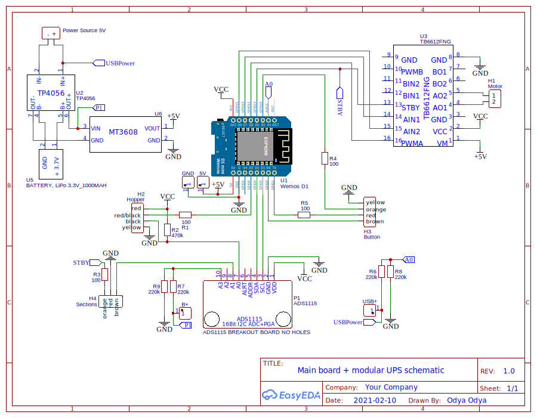

# esphome-petnet-feeder
Petnet SmartFeeder 1st Gen revival project. Bring your feeder back to life with ESP8266 controller and native Petnet hardware!

## Hardware
- [EasyEDA Project](https://oshwlab.com/ganzevich/petnet-feeder)
- [PCB in Gerber format](docs/Gerber_PCB_PetNet%20Feeder.zip)
- [BOM](docs/BOM_PCB_PetNet%20Feeder.csv)

## Installation
1) Clone project to subdir in your ESPHome config directory:
``git clone https://github.com/odya/esphome-petnet-feeder.git``
2) Now `main.yaml` must be located under `<esphome_config>/petnet-feeder`
3) Create file `petnet-feeder.yaml` in the config directory root and copy contents of [example config](/examples/petnet-feeder.yaml)
4) Edit & customize `petnet-feeder.yaml`
